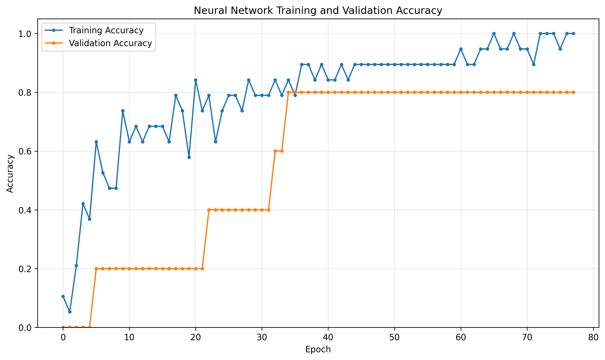

# 🌧️ AI-Based District Rainfall Deviation and Anomaly Analysis

## 📌 Overview

The **AI-Based District Rainfall Deviation and Anomaly Analysis** project is a Machine Learning and Deep Learning-based system designed to analyze district-level rainfall patterns.

The project compares **actual rainfall** with **normal rainfall** across different districts and calculates the percentage deviation from normal rainfall conditions.

Based on the calculated deviation, districts are classified into rainfall categories such as:

- **Deficient**
- **Normal**
- **Excess**

The project uses **Random Forest** and a **Neural Network** for rainfall classification and prediction.

In addition, two optimization techniques are implemented:

- **Artificial Immune System (AIS)**
- **Particle Swarm Optimization (PSO)**

These optimization algorithms are used for **feature selection**, helping identify useful rainfall attributes before training the classification models.

---

# 🎯 Project Objective

The main objectives of this project are:

- Analyze district-wise rainfall information.
- Compare actual rainfall with normal rainfall.
- Calculate rainfall deviation percentages.
- Identify deficient, normal, and excess rainfall conditions.
- Train Machine Learning and Deep Learning models.
- Compare model performance using multiple evaluation metrics.
- Apply AIS for optimized feature selection.
- Apply PSO for optimized feature selection.
- Generate district-wise rainfall predictions.
- Generate model confidence scores.
- Visualize model training performance.
- Save trained models for future use.
- Export analysis and prediction results as CSV files.
- Store model configuration and metadata using YAML and JSON.

---

# 📂 Dataset

The project uses the following dataset:

```text
Rainfalldistrict_2.csv
```

The dataset contains district-level rainfall information consisting of **actual rainfall** and **normal rainfall** measurements.

The rainfall information can represent multiple seasonal periods such as:

- Southwest Monsoon
- Northeast Monsoon
- Winter
- Hot Weather Season
- Annual rainfall

The exact rainfall columns are automatically detected during preprocessing.

---

# 📊 Dataset Features

The dataset primarily contains:

| Feature | Description |
|---|---|
| District | Name of the district |
| Actual Rainfall | Rainfall actually recorded |
| Normal Rainfall | Expected or historical normal rainfall |
| Seasonal Rainfall | Rainfall information for different seasons |
| Annual Rainfall | Overall annual rainfall information |

Additional features are calculated automatically during analysis.

---

# 🧮 Rainfall Deviation Calculation

The rainfall deviation percentage is calculated using:

```text
Rainfall Deviation (%) =
((Actual Rainfall - Normal Rainfall) / Normal Rainfall) × 100
```

For example:

```text
Actual Rainfall = 750 mm
Normal Rainfall = 1000 mm

Deviation = ((750 - 1000) / 1000) × 100

Deviation = -25%
```

Therefore, the district has received **25% less rainfall than normal**.

---

# 🏷️ Rainfall Classification

Districts are classified according to their rainfall deviation.

The project uses the following simplified classification thresholds:

| Deviation | Category |
|---|---|
| Less than -20% | Deficient |
| -20% to +20% | Normal |
| Greater than +20% | Excess |

The generated target column is:

```text
Rainfall_Category
```

---

# 🧹 Data Preprocessing

Before model training, several preprocessing operations are performed.

These include:

1. Loading the CSV dataset.
2. Cleaning column names.
3. Removing completely empty rows.
4. Removing completely empty columns.
5. Detecting the district column.
6. Converting rainfall measurements to numeric values.
7. Handling missing values.
8. Detecting actual rainfall columns.
9. Detecting normal rainfall columns.
10. Calculating total actual rainfall.
11. Calculating total normal rainfall.
12. Calculating rainfall deviation percentage.
13. Generating rainfall categories.
14. Encoding categorical target labels.
15. Scaling numerical features.

The preprocessing stage ensures that the rainfall data can be used effectively by the Machine Learning and Deep Learning models.

---

# 🤖 Machine Learning Model

## Random Forest Classifier

The project uses a **Random Forest Classifier** as the primary Machine Learning model.

Random Forest combines multiple decision trees and determines the final prediction based on the predictions generated by those trees.

### Advantages

- Works effectively with numerical datasets.
- Handles nonlinear relationships.
- Provides feature importance.
- Relatively resistant to overfitting compared with a single decision tree.
- Suitable for small and medium-sized structured datasets.
- Can perform multiclass classification.

The model predicts one of the following classes:

```text
Deficient
Normal
Excess
```

---

# 🧠 Deep Learning Model

A feed-forward **Artificial Neural Network (ANN)** is also implemented.

The neural network contains multiple dense layers.

Example architecture:

```text
Input Layer
     ↓
Dense Layer (64 neurons, ReLU)
     ↓
Dropout
     ↓
Dense Layer (32 neurons, ReLU)
     ↓
Dropout
     ↓
Dense Layer (16 neurons, ReLU)
     ↓
Output Layer (Softmax)
```

The output layer uses **Softmax activation** to perform multiclass rainfall classification.

---

# ⚙️ Neural Network Configuration

The neural network uses:

```text
Optimizer: Adam
Loss Function: Sparse Categorical Crossentropy
Output Activation: Softmax
Maximum Epochs: 200
Batch Size: 8
```

Early stopping is used to reduce unnecessary training and restore the best model weights when validation performance stops improving.

---

# 🧬 Artificial Immune System (AIS)

The project includes an **Artificial Immune System-based feature selection technique**.

AIS is a bio-inspired optimization approach based on concepts from the biological immune system.

In this project, candidate feature subsets are represented as artificial antibodies.

Example:

```text
[1, 0, 1, 1, 0, 1]
```

Where:

```text
1 = Feature selected
0 = Feature not selected
```

---

# 🧬 AIS Feature Selection Process

The AIS optimization process performs the following steps:

```text
Generate antibody population
        ↓
Evaluate feature subsets
        ↓
Calculate fitness
        ↓
Select high-fitness antibodies
        ↓
Clone selected antibodies
        ↓
Apply mutation
        ↓
Evaluate new antibodies
        ↓
Retain stronger solutions
        ↓
Repeat for multiple generations
        ↓
Return best feature subset
```

The fitness function considers model performance while applying a small penalty when too many features are selected.

This encourages the algorithm to search for a compact and useful feature subset.

---

# 🐦 Particle Swarm Optimization (PSO)

The project also implements **Binary Particle Swarm Optimization (BPSO)**.

PSO is a population-based optimization technique inspired by the collective movement of groups such as bird flocks.

Each particle represents a possible rainfall feature subset.

For example:

```text
Particle = [1, 0, 1, 0, 1]
```

Here:

```text
1 = Feature selected
0 = Feature not selected
```

---

# 🔄 PSO Optimization Process

The Binary PSO feature-selection workflow is:

```text
Initialize particles
        ↓
Initialize particle velocities
        ↓
Evaluate fitness
        ↓
Determine personal best
        ↓
Determine global best
        ↓
Update velocities
        ↓
Apply sigmoid transformation
        ↓
Update binary positions
        ↓
Evaluate new feature subsets
        ↓
Repeat for multiple iterations
        ↓
Return global best feature subset
```

---

# 📐 PSO Velocity Update

The PSO velocity is updated conceptually using:

```text
V(t+1) =
wV(t)
+
c1 × r1 × (PersonalBest - CurrentPosition)
+
c2 × r2 × (GlobalBest - CurrentPosition)
```

Where:

```text
w  = Inertia weight
c1 = Cognitive coefficient
c2 = Social coefficient
r1 = Random value
r2 = Random value
```

For binary feature selection, the particle velocity is transformed into a probability using a sigmoid function.

---

# 🧪 Model Evaluation

The models are evaluated using several classification metrics.

These include:

- Accuracy
- Precision
- Recall
- F1 Score
- Confusion Matrix

This allows the performance of Random Forest and Neural Network models to be compared.

---

# 📈 Accuracy Visualization

The main visualization used in this project is:

```text
accuracy_graph.png
```

It shows the training and validation accuracy of the neural network across epochs.



The graph can be used to observe:

- Training progress
- Validation performance
- Model convergence
- Differences between training and validation accuracy
- Possible signs of overfitting

---

# 🔥 Confusion Matrix

The project generates:

```text
heatmap.png
```

The confusion matrix shows how the model's predicted rainfall categories compare with the actual categories.

It helps identify correctly classified and incorrectly classified rainfall conditions.

---

# 📊 Model Comparison

The project generates:

```text
model_comparison_graph.png
```

The graph compares Random Forest and Neural Network using:

```text
Accuracy
Precision
Recall
F1 Score
```

This provides a visual comparison of the two model approaches.

---

# 📄 Result CSV

The project generates:

```text
result.csv
```

It contains information such as:

| Column | Description |
|---|---|
| District | District name |
| Actual_Rainfall | Calculated actual rainfall |
| Normal_Rainfall | Calculated normal rainfall |
| Deviation_Percentage | Percentage difference from normal rainfall |
| Rainfall_Category | Deficient, Normal, or Excess |

---

# 📊 Result Visualization

The project generates:

```text
result_graph.png
```

This graph displays district-wise rainfall deviation percentages.

Reference lines can be used to indicate:

```text
-20% = Deficient threshold
+20% = Excess threshold
```

This makes it easier to identify districts with unusual rainfall conditions.

---

# 🔮 Prediction CSV

The project generates:

```text
prediction.csv
```

The prediction file can contain:

| Column | Description |
|---|---|
| District | District name |
| Actual_Rainfall | Actual rainfall |
| Normal_Rainfall | Normal rainfall |
| Deviation_Percentage | Rainfall deviation |
| Actual_Category | Calculated rainfall category |
| RF_Predicted_Category | Random Forest prediction |
| RF_Confidence_Percentage | Random Forest confidence |
| NN_Predicted_Category | Neural Network prediction |
| NN_Confidence_Percentage | Neural Network confidence |

---

# 📈 Prediction Visualization

The prediction graph is saved as:

```text
prediction_graph.png
```

It visualizes district-wise model prediction confidence.

This allows the prediction behavior of Random Forest and Neural Network models to be compared.

---

# 🧬 AIS Outputs

The AIS implementation generates files with the `ais_` prefix.

Examples:

```text
ais_rainfall_model.h5
ais_rainfall_model.pkl
ais_config.yaml
ais_metadata.json

ais_accuracy_graph.png
ais_heatmap.png
ais_comparison_graph.png

ais_result.csv
ais_result_graph.png

ais_prediction.csv
ais_prediction_graph.png

ais_feature_selection.csv
ais_feature_selection_graph.png
ais_feature_importance_graph.png

ais_actual_vs_normal_rainfall.png
ais_category_distribution.png
```

---

# 🐦 PSO Outputs

The PSO implementation generates files with the `pso_` prefix.

Examples:

```text
pso_rainfall_model.h5
pso_rainfall_model.pkl
pso_config.yaml
pso_metadata.json

pso_accuracy_graph.png
pso_heatmap.png
pso_comparison_graph.png

pso_result.csv
pso_result_graph.png

pso_prediction.csv
pso_prediction_graph.png

pso_feature_selection.csv
pso_feature_selection_graph.png
pso_feature_importance_graph.png

pso_actual_vs_normal_rainfall.png
pso_category_distribution.png
```

---

# 💾 Saved Model Files

## H5 Model

```text
rainfall_model.h5
```

The H5 file stores the trained neural network.

Optimized versions include:

```text
ais_rainfall_model.h5
pso_rainfall_model.h5
```

---

## PKL Model

```text
rainfall_model.pkl
```

The PKL file stores Machine Learning components such as:

- Random Forest model
- StandardScaler
- LabelEncoder
- Feature names
- Rainfall classification thresholds

Optimized versions include:

```text
ais_rainfall_model.pkl
pso_rainfall_model.pkl
```

---

# ⚙️ YAML Configuration

Configuration information is stored in:

```text
rainfall_config.yaml
```

AIS and PSO versions include:

```text
ais_config.yaml
pso_config.yaml
```

These files can contain:

- Dataset information
- Model configuration
- Selected features
- Optimization parameters
- Evaluation results

---

# 📋 JSON Metadata

Project metadata is stored in:

```text
rainfall_metadata.json
```

Optimization-specific versions include:

```text
ais_metadata.json
pso_metadata.json
```

The JSON metadata can contain:

- Project name
- Dataset name
- Feature names
- Target classes
- Selected features
- Model metrics
- Optimization parameters
- Best fitness values

---

# 📁 Project Structure

```text
AI-Based District Rainfall Deviation and Anomaly Analysis/
│
├── Rainfalldistrict_2.csv
│
├── README.md
│
├── rainfall_model.h5
├── rainfall_model.pkl
├── rainfall_config.yaml
├── rainfall_metadata.json
│
├── accuracy_graph.png
├── heatmap.png
├── model_comparison_graph.png
├── result.csv
├── result_graph.png
├── prediction.csv
├── prediction_graph.png
├── actual_vs_normal_rainfall.png
├── rainfall_category_distribution.png
│
├── ais_rainfall_model.h5
├── ais_rainfall_model.pkl
├── ais_config.yaml
├── ais_metadata.json
├── ais_accuracy_graph.png
├── ais_heatmap.png
├── ais_comparison_graph.png
├── ais_result.csv
├── ais_result_graph.png
├── ais_prediction.csv
├── ais_prediction_graph.png
├── ais_feature_selection.csv
├── ais_feature_selection_graph.png
├── ais_feature_importance_graph.png
├── ais_actual_vs_normal_rainfall.png
├── ais_category_distribution.png
│
├── pso_rainfall_model.h5
├── pso_rainfall_model.pkl
├── pso_config.yaml
├── pso_metadata.json
├── pso_accuracy_graph.png
├── pso_heatmap.png
├── pso_comparison_graph.png
├── pso_result.csv
├── pso_result_graph.png
├── pso_prediction.csv
├── pso_prediction_graph.png
├── pso_feature_selection.csv
├── pso_feature_selection_graph.png
├── pso_feature_importance_graph.png
├── pso_actual_vs_normal_rainfall.png
└── pso_category_distribution.png
```

---

# 🛠️ Technologies Used

The project is developed using:

- Python
- Pandas
- NumPy
- Matplotlib
- Scikit-learn
- TensorFlow
- Keras
- PyYAML
- Pickle
- JSON

---

# 📦 Required Python Libraries

Install the required libraries using:

```bash
pip install pandas numpy matplotlib scikit-learn tensorflow pyyaml
```

---

# ▶️ How to Run the Project

## Step 1: Download the Project

Clone the repository:

```bash
git clone <your-repository-url>
```

Move into the project directory:

```bash
cd "AI-Based District Rainfall Deviation and Anomaly Analysis"
```

---

## Step 2: Install Dependencies

```bash
pip install pandas numpy matplotlib scikit-learn tensorflow pyyaml
```

---

## Step 3: Add the Dataset

Place:

```text
Rainfalldistrict_2.csv
```

inside the project directory.

---

## Step 4: Configure the Dataset Path

For the local Windows implementation used during development:

```python
PROJECT_DIR = (
    r"C:\Users\sagni\Downloads"
    r"\AI-Based District Rainfall Deviation and Anomaly Analysis"
)
```

The dataset path is:

```python
CSV_PATH = os.path.join(
    PROJECT_DIR,
    "Rainfalldistrict_2.csv"
)
```

Change the project directory when running the project on another computer.

---

## Step 5: Run the Base Model

Run the base rainfall analysis script to generate:

```text
accuracy_graph.png
heatmap.png
model_comparison_graph.png
result.csv
prediction.csv
```

along with the trained model files.

---

## Step 6: Run AIS Optimization

Run the AIS implementation to perform Artificial Immune System-based feature selection.

The generated outputs will use:

```text
ais_
```

as their filename prefix.

---

## Step 7: Run PSO Optimization

Run the PSO implementation to perform Binary Particle Swarm Optimization-based feature selection.

The generated outputs will use:

```text
pso_
```

as their filename prefix.

---

# 🔬 Experimental Workflow

The complete project workflow can be summarized as:

```text
Rainfall Dataset
       ↓
Data Cleaning
       ↓
Missing Value Handling
       ↓
Actual / Normal Rainfall Identification
       ↓
Rainfall Deviation Calculation
       ↓
Rainfall Category Generation
       ↓
Feature Preparation
       ↓
Train / Test Split
       ↓
 ┌───────────────────────────────┐
 │        Optimization           │
 │                               │
 │   Base      AIS       PSO     │
 │     ↓        ↓         ↓      │
 │ Features  Features   Features │
 └───────────────────────────────┘
       ↓
Feature Scaling
       ↓
Random Forest
       +
Neural Network
       ↓
Model Evaluation
       ↓
Predictions
       ↓
CSV Results
       ↓
Graphs and Visualizations
       ↓
Saved Models
```

---

# 🧪 Evaluation Strategy

The dataset is divided into:

```text
Training Data
Testing Data
```

For the optimization implementations, the train/test split is performed **before AIS or PSO feature selection**.

AIS and PSO evaluate candidate feature subsets using only the training portion of the dataset.

The held-out test set is then used to calculate final metrics.

This reduces direct leakage of final test information into the feature-selection process.

---

# ⚠️ Dataset Size Consideration

The rainfall dataset contains a relatively small number of district-level observations.

Because of this, test accuracy can change noticeably depending on:

- Train/test split
- Class distribution
- Random seed
- Selected features
- Model configuration

Therefore, the generated accuracy should be interpreted as an **experimental result for this dataset**, rather than evidence that the model will generalize to rainfall data from all regions or future years.

Cross-validation and additional multi-year rainfall data would provide a stronger evaluation.

---

# 💡 Applications

This project demonstrates techniques that can support applications such as:

- Rainfall pattern analysis
- District rainfall monitoring
- Rainfall deviation identification
- Agricultural planning research
- Drought-related exploratory analysis
- Excess rainfall analysis
- Environmental data analysis
- Climate-data research
- Machine Learning education
- Optimization algorithm comparison

---

# 🚀 Future Enhancements

The project can be extended by:

- Adding rainfall data from multiple years.
- Incorporating temperature data.
- Adding humidity information.
- Including geographical coordinates.
- Incorporating soil moisture measurements.
- Adding satellite-derived rainfall information.
- Using time-series forecasting techniques.
- Implementing LSTM models for temporal rainfall prediction.
- Comparing additional ML algorithms such as XGBoost and SVM.
- Adding SHAP-based model explanations.
- Developing an interactive rainfall dashboard.
- Integrating GIS-based district visualization.
- Evaluating AIS and PSO using repeated cross-validation.
- Performing hyperparameter optimization.
- Developing a web-based rainfall prediction application.

---

# 📌 Key Features

- District-wise rainfall analysis
- Actual vs normal rainfall comparison
- Rainfall deviation calculation
- Rainfall category classification
- Random Forest classification
- Neural Network classification
- AIS feature selection
- Binary PSO feature selection
- Accuracy visualization
- Confusion matrix generation
- Model comparison
- Feature importance analysis
- Prediction confidence analysis
- CSV result generation
- H5 model storage
- PKL model storage
- YAML configuration storage
- JSON metadata storage

---

# 📊 Main Visualization

The primary visualization for this repository is:

```text
accuracy_graph.png
```


This visualization represents the neural network's **training and validation accuracy across epochs**.

---

# 📌 Conclusion

The **AI-Based District Rainfall Deviation and Anomaly Analysis** project demonstrates how Machine Learning, Deep Learning, and bio-inspired optimization techniques can be combined for district-level rainfall analysis.

The system calculates rainfall deviation by comparing actual and normal rainfall measurements and classifies districts into **Deficient, Normal, and Excess** rainfall categories.

A **Random Forest Classifier** and an **Artificial Neural Network** are used to model rainfall categories, while **Artificial Immune System (AIS)** and **Particle Swarm Optimization (PSO)** approaches are used to investigate optimized feature subsets.

The project also generates model evaluation graphs, district-level result files, prediction outputs, feature-selection information, and reusable trained model files.

Because the current dataset is relatively small, the project is best treated as an **experimental rainfall analytics and machine-learning framework**. Future work using multi-year and larger-scale rainfall datasets could improve the reliability and practical applicability of the models.

---

# 👨‍💻 Author

Developed as a Machine Learning and Deep Learning project for **district-level rainfall deviation and anomaly analysis**.

---

# 📜 License

This project is intended for **educational and research purposes**.
